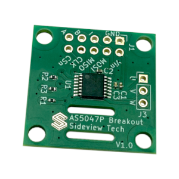
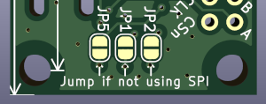
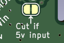
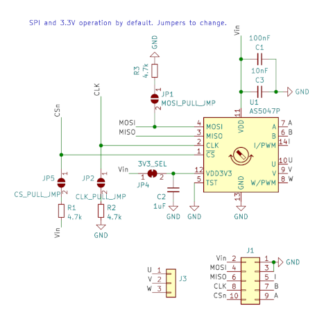
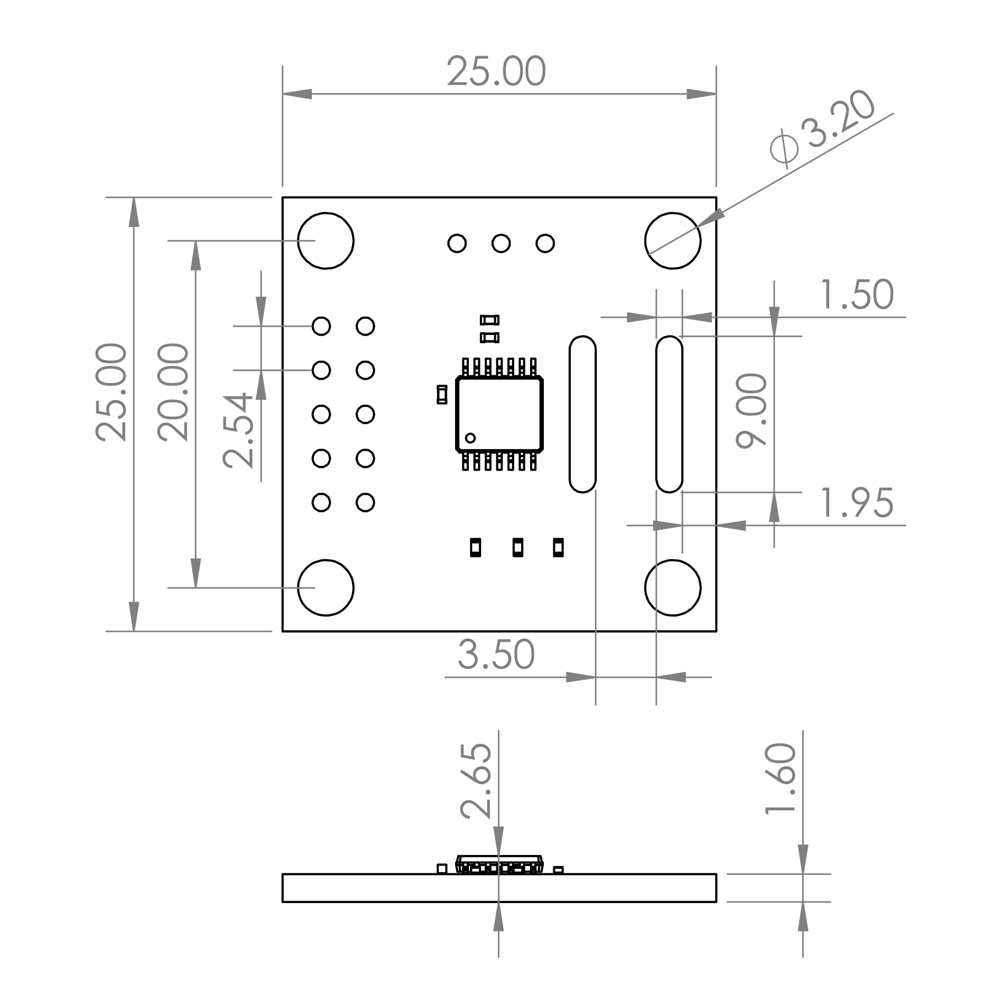

# Sideview Tech AS5047P Breakout Board

A compact breakout board for the **AS5047P** magnetic rotary position sensor. I sell them on Amazon [here](https://a.co/d/bI0XgS7). This repo contains documentation and CAD to help you get started and develop with this board.

Note that I am not affiliated with AMS Osram, the maker of the sensor chip itself.

## Documents
- [AS5047P official datasheet](http://bit.ly/as5047p)
- [Quick guide for this board](docs/sideview_as5047p_quick_guide.pdf)

## Jumpers
**By default, this breakout board is set to run on 3.3V and communicate over SPI. If you are fine with this, no need to read this section.** 

Input voltage and communication output can be changed by soldering/cutting jumpers on the board. Note that I've found the AS5047P to be very tolerant, and it will possibly run ok anyway. However, this goes against the datasheet recommendations and may reduce the life of the IC or immediately fry it.

If SPI is not being used (i.e, you're using ABI or UVW), all three of these jumpers should be individually bridged with solder. This enables a pull-up resistor on CSn and pull-down resistors on CLK and MOSI. These resistors are already on the board and just need the jumper pads to be connected.

To enable 5V power input on Vin, this jumper should be cut. There is a small trace between the two exposed pads that can be cut with a razor blade. It's a good idea to check (dis)continuity between the pads to make sure you've cut the trace completely. The board can be reverted to 3.3V operation by soldering the jumper back again.

Essentially, this jumper determines whether or not the internal 3.3V voltage regulator of the AS5047P is bypassed or not. See the datasheet for more info.

## Magnets
The included magnet is:
- Diametrically magnetized
- 6mm diameter, 2.5mm thickness
- N45H grade neodymium magnet

Any diametrically-magnetized motor should work with this sensor. A lot of motors intended for robotics have a magnet already built-in on the shaft on the back of the motor. It's worth checking anyway. For quickly telling how something is magnetized, I highly recommend this [viewing film](https://www.amazon.com/dp/B0BCFM83XB).

### Magnet mounting
Typically the magnet is attached to the end of a rotating shaft and a few mm above the sensor chip. For initial testing, you can often just have the magnet stick to the end of a steel shaft on its own. Over time though, it will slip and cause the zero-position to shift. A dab of superglue between the magnet and the shaft is often good enough for prototypes. For more durability, you can graduate to a 3D print or a shaft coupler.

## Software Libraries
I take no credit for these libraries, though I do like them!
- [Arduino AS5047P Library](https://github.com/jonas-merkle/AS5047P)
   - Easiest way to get started with the sensor over SPI.
   - Install with the Arduino library manager.
- [Arduino quadrature encoder (AB) encoder library](https://github.com/PaulStoffregen/Encoder)
   - Install with the Arduino library manager.
- [STM32 HAL/ other platform library](https://github.com/ziteh/as5047p-driver)
   - Easy to use with platformio, e.g. `lib_deps = ziteh/as5047-driver@^2.0.0`
   - Don't use for stm32duino. The Arduino libraries are more suitable.

## Schematic

## Dimensions

## Contact
For questions, email [matt@sideview.bike](mailto:matt@sideview.bike).
