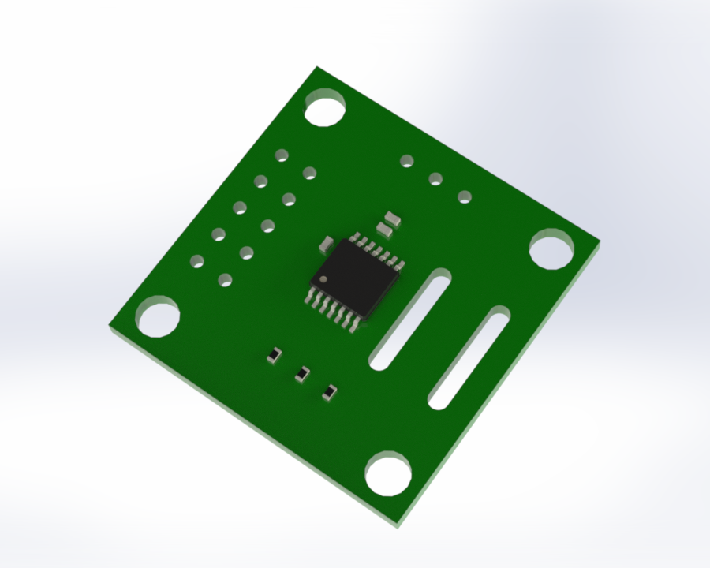
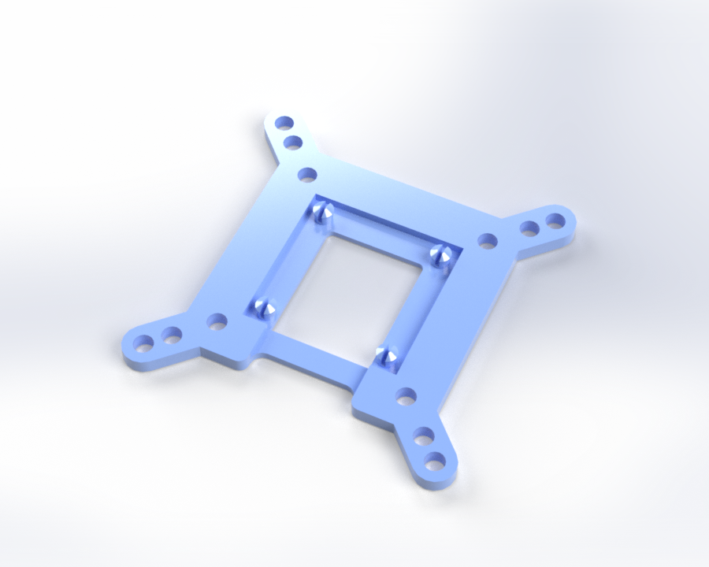
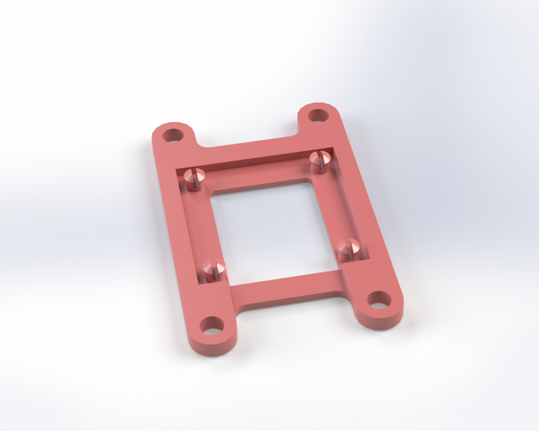

# CAD Models
STEP files for the Sideview AS5047P breakout board and a few example mounts. The mounts can be 3D printed, and the board is meant to snap into place with a little pressure. I am open to accepting or designing other models for specific motors if there is demand.

## [as5047_breakout.step](as5047_breakout.step)

Full board with components.

## evm_mb_adapter.step

This is an adapter for making the Sideview board fit where AMS's AS5X47P_TS_EVM_MB would. It's a little thicker in total, but the holes should line up.

## mot_bracket_example.step

Another example mounting bracket. It fits [TODO] motor, but should be easy to adapt to other applications.